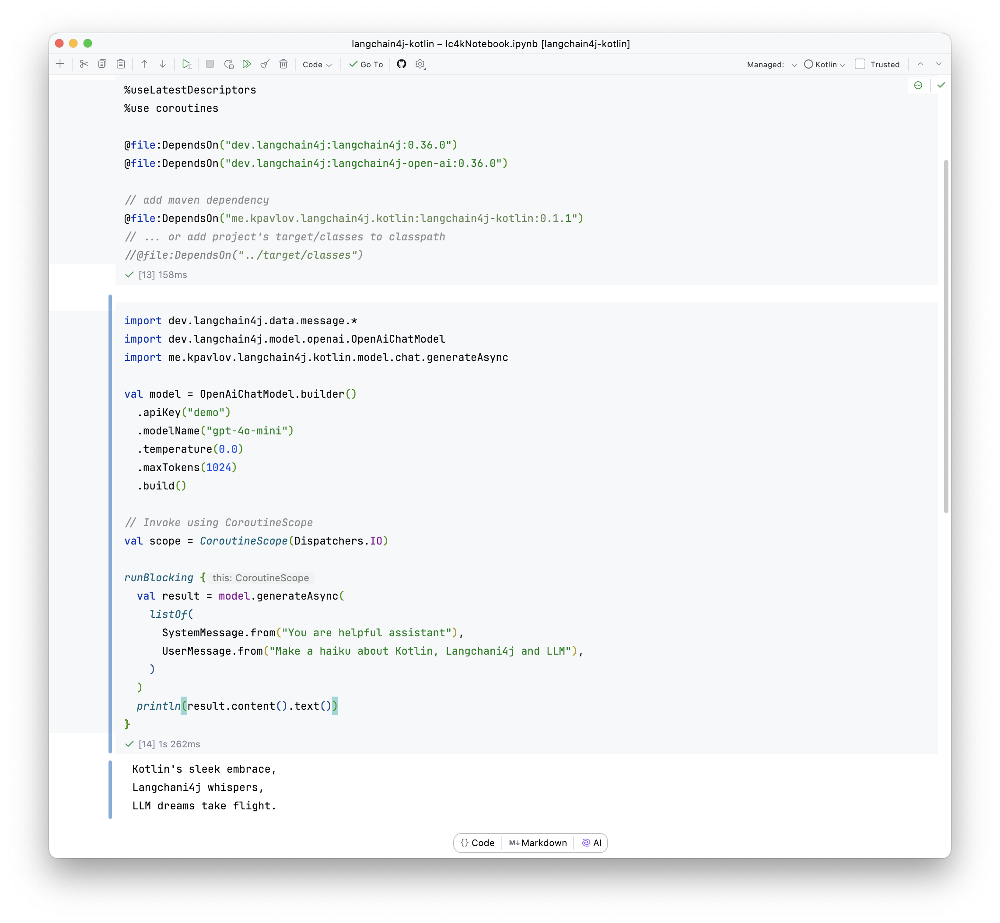

# LangChain4j-Kotlin

[](https://repo1.maven.org/maven2/me/kpavlov/langchain4j/kotlin/)
[](https://github.com/kpavlov/langchain4j-kotlin/actions/workflows/maven.yml)
[](https://app.codacy.com/gh/kpavlov/langchain4j-kotlin/dashboard?utm_source=gh&utm_medium=referral&utm_content=&utm_campaign=Badge_grade)
[](https://app.codacy.com/gh/kpavlov/langchain4j-kotlin/dashboard?utm_source=gh&utm_medium=referral&utm_content=&utm_campaign=Badge_coverage)

Kotlin enhancements for [LangChain4j](https://github.com/langchain4j/langchain4j), providing coroutine support and Flow-based streaming capabilities for chat language models.

See the [discussion](https://github.com/langchain4j/langchain4j/discussions/1897) on LangChain4j project.

## Features

- ✨ [Kotlin Coroutine](https://kotlinlang.org/docs/coroutines-guide.html) support for [ChatLanguageModels](https://docs.langchain4j.dev/tutorials/chat-and-language-models)
- 🌊 [Kotlin Asynchronous Flow](https://kotlinlang.org/docs/flow.html) support for [StreamingChatLanguageModels](https://docs.langchain4j.dev/tutorials/ai-services#streaming)

## Installation

### Maven

Add the following dependencies to your `pom.xml`:

```xml
<dependencies>
    <!-- LangChain4j Kotlin Extensions -->
    <dependency>
        <groupId>me.kpavlov.langchain4j.kotlin</groupId>
        <artifactId>langchain4j-kotlin</artifactId>
        <version>[LATEST_VERSION]</version>
    </dependency>
    
    <!-- Required Dependencies -->
    <dependency>
        <groupId>dev.langchain4j</groupId>
        <artifactId>langchain4j-core</artifactId>
    </dependency>
    <dependency>
        <groupId>org.jetbrains.kotlinx</groupId>
        <artifactId>kotlinx-coroutines-core-jvm</artifactId>
    </dependency>
</dependencies>
```

### Gradle (Kotlin DSL)

Add the following to your `build.gradle.kts`:

```kotlin
dependencies {
    implementation("me.kpavlov.langchain4j.kotlin:langchain4j-kotlin:$LATEST_VERSION")
    implementation("dev.langchain4j:langchain4j-core")
    implementation("org.jetbrains.kotlinx:kotlinx-coroutines-core-jvm")
}
```

## Quick Start

### Basic Chat Request

```kotlin
val model: ChatLanguageModel = OpenAiChatModel.builder()
    .apiKey("your-api-key")
    // more configuration parameters here ...
    .build()

// Using coroutines
val response = model.chatAsync(ChatRequest.builder()
    .messages(listOf(
        SystemMessage.from("You are a helpful assistant"),
        UserMessage.from("Hello!")
    ))
)
```

### Streaming Chat

```kotlin
val model: StreamingChatLanguageModel = OpenAiStreamingChatModel.builder()
    .apiKey("your-api-key")
    // more configuration parameters here ...
    .build()

model.generateFlow(messages)
    .collect { reply ->
        when (reply) {
            is StreamingChatLanguageModelReply.Token -> 
                println("Received token: ${reply.token}")
            is StreamingChatLanguageModelReply.Completion -> 
                println("Final response: ${reply.response.content().text()}")
        }
    }
```

### Kotlin Notebook

The [Kotlin Notebook](https://kotlinlang.org/docs/kotlin-notebook-overview.html) environment allows you to:

* Experiment with LLM features in real-time
* Test different configurations and scenarios
* Visualize results directly in the notebook
* Share reproducible examples with others

You can easyly get started with LangChain4j-Kotlin notebooks:

```kotlin notebook
%useLatestDescriptors
%use coroutines

@file:DependsOn("dev.langchain4j:langchain4j:0.36.0")
@file:DependsOn("dev.langchain4j:langchain4j-open-ai:0.36.0")

// add maven dependency
@file:DependsOn("me.kpavlov.langchain4j.kotlin:langchain4j-kotlin:0.1.1")
// ... or add project's target/classes to classpath
//@file:DependsOn("../target/classes")

import dev.langchain4j.data.message.*
import dev.langchain4j.model.openai.OpenAiChatModel
import me.kpavlov.langchain4j.kotlin.model.chat.generateAsync
  
val model = OpenAiChatModel.builder()
  .apiKey("demo")
  .modelName("gpt-4o-mini")
  .temperature(0.0)
  .maxTokens(1024)
  .build()

// Invoke using CoroutineScope
val scope = CoroutineScope(Dispatchers.IO)

runBlocking {
  val result = model.generateAsync(
    listOf(
      SystemMessage.from("You are helpful assistant"),
      UserMessage.from("Make a haiku about Kotlin, Langchani4j and LLM"),
    )
  )
  println(result.content().text())
}
```
Try [this Kotlin Notebook](langchain4j-kotlin/notebooks/lc4kNotebook.ipynb)  yourself:


## Development Setup

### Prerequisites

1. Create `.env` file in root directory and add your API keys:

```dotenv
OPENAI_API_KEY=sk-xxxxx
```

### Building the Project

Using Maven:
```shell
mvn clean verify
```

Using Make:
```shell
make build
```

## Contributing

Contributions are welcome! Please feel free to submit a Pull Request.

Run before submitting your changes
```shell
make lint
```

## Acknowledgements

- [LangChain4j](https://github.com/langchain4j/langchain4j) - The core library this project enhances
- Training data from Project Gutenberg:
  - [CAPTAIN BLOOD By Rafael Sabatini](https://www.gutenberg.org/cache/epub/1965/pg1965.txt)

## License

[MIT License](LICENSE.txt)
